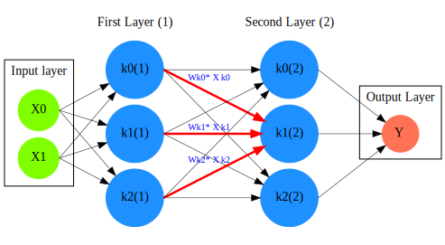

= Principles of Artificial Neural Networks and Machine Learning for Bioinformatics Applications

Konstantinos Krampis*^1^, Eric Ross^2^, Olorunseun O. Ogunwobi^1^, Grace Ma,^3^ Raja Mazumder,^4^ Claudia Wultsch^1^

:stem:
:bibtex-file: ./GDL-bibliography/references.bib

^1^Belfer Research Facility, Biological Sciences, Hunter College, City University of New York, NY, USA
^2^Fox Chase Cancer Center, Philadephia, PA, USA
^3^Center for Asian Health, Lewis Katz School of Medicine, Temple University, Philadelphia, PA, USA
^4^Biochemistry and Molecular Biology, George Washington University, Washington D.C., USA

^*^Corresponding Author, _agbiotec@gmail.com_

== ABSTRACT 
With the exponential growth of machine learning and development of Artificial
Neural Network (ANNs) in recent years, there is great opportunity to leverage
this approach and accelarate biological discoveries through applications on the
analysis of bioinformatics data.  Various types of datasets including for
example protein or gene interaction networks, molecular structures and cellular
signalling pathways, have already been used for machine learning by training
ANNs for inference and pattern classification.  However, unlike regular data
structures that are commonly used in the computer science and engineering
fields, bioinformatics datasets present challenges that require unique
algorithmic approaches.  The recent development of the geometric and deep
learning approach within the machine learning field, is very promising towards
accelerating analysis complex bioinformatics datasets.  The principles of ANNs
and their importance for bioinformatics machine learning is demonstrated
herein, through presentation of the undelying mathematical and statistical
foundations from group theory, symmetry, linear algebra.  Furthermore, the
structure and functions of ANN algorithms that form the core principles of
artificial intelligence are explained, in relation to the bioinformatics data
domain.  Overall, the manuscript provides guidance for researchers to
understand the principles required for practicing machine learning and
artificial intelligence, with the special considerations towards bioinformatics
applications.

== INTRODUCTION

Symmetry and invariance is a central concept in physics, mathematical and
biological systems, and has been established since the early 20th century that
fundamental principles of nature are based on symmetry cite:[noether1918invariante].
In the last decade, technologies such as genomic
sequencing have enabled an exponential increase cite:[katz2022sequence] of the
data that describe the molecular elements, structure and function of biological
systems. Furthermore, data generation in fields as diverse as physics, software
development and social media cite:[clissa2022survey], have resulted in datasets
of scale not previously available to scientists. This data abundance, has been
fundamental for the ever accelerating advancements in the field of machine
learning, deep learning and artificial intelligence, where we now  have
algorithms that can be trained to make discoveries from the data, at a level
that closely matches human intuition.

The field of deep learning and artificial intelligence, has developed rapidly
within the span of a few years, and while researchers have developed hundreds
of successful algorithms, there currently few unifying principles to organize
systematically the machine learning algorithms. In a seminal `proto-book` by
Bronstein et al.  cite:[bronstein2021geometric], a range of systematization
principles for the different Artificial Neural Network (ANN) architectures and
deep learning algorithms were presented, based on the concepts of symmetry and
mathematical group theory.  The authors also introduced the concept of
geometric deep learning, and demonstrated how the group theory, function
invariance and equivariance principles, can be used as basis towards composing
and describing the various deep learning algorithms. Along these lines, in the
present manuscript we explain the structure of ANNs and the principles of machine
learning algorithms, while providing a review of mathematical and statistical
foundations related to the  development of artificial intelligence applications
with bioinformatics data.

== THE STRUCTURE OF ARTIFICIAL INTELLIGENCE AND NEURAL NETWORKS

We will first describe the structures and function of deep learning and
Artificial Neural Networks (ANNs) that are the basis of artificial intelligence
cite:[li2019deep]. Assume a dataset consisting of _n_ pairs of
stem:[(x_i,y_i)_n], with the stem:[x_i] being _n_ data points and stem:[y_i]
their labels. Each stem:[x_i] data point can be for example be a number, a
vector (array of numbers), or a matrix (grid of numbers) storing diffent types
of bioinformatics data.  The data and labels can be of various formats, such as
binary (two-option) as for example stem:[y_i=1] "inhibits cancer growth", or
stem:[y_i=0] "does not inhibit cancer". The labels can also be continuous
numbers such as for example stem:[y_i=0.3] meaning 30% inhibition, or a
composite label such as stem:[y_i = (0,1,0)] representing respectively drug
attributes such as '0 - no inhibition', '1 - yes for toxicity', '0 - not
metabolized'. Similarly, the input data points can also be composite such as
for example stem:[x_i = (50,100)] representing two measuments for a single
biological entity. Independently of the label structure, the deep learning
algorithms and the overall goal of artificial intelligence applications for
bioinformatics, is to first train the ANN with data for which the labels are
known, and then perform classification of newly generated data, by predicting
their labels. 

The simplest structure of an artificial neural network as shown on *Fig.1* is
"fully connected", with each neuron _k_ in the ANN having a number of incoming
and outgoing connections corresponding to the number of neurons in previous and
next layer in the neural network. For example the neuron stem:[k_0^(1)] of the
_First Layer (1)_ on *Fig.1*, has stem:[n = 2] incoming and stem:[n = 3] outgoing
connections, corresponding respectively to the "input layer" with two neurons,
and three connections with the neurons of the internal ("hidden layer") labeled
_Second Layer (2)_ on the figure. The internal layers are called "hidden"
since they do not receive input data directly, similarly to the neurons performing
cognition in animal brains, as opposed to sensory neurons. While the hidden
layers can have an arbitrary number of neurons based on the complexity of
the label classification problem we need the ANN to resolve cite:[uzair2020effects], the input
layer has the exact number of neurons corresponding to the input data structure. On
*Fig. 1* for example we have two input neurons, and the data can be of the
form stem:[x_i = (50,100)]. Finally, the output layer has a number of neurons 
corresponding to the number of labels stem:[y_i] per input data point in the data, 
and on *Fig. 1* there is a single label.

.An example *Artificial Neural Network (ANN)*. The signal aggregation taking place on the second neuron stem:[sigma_(k_1^((2)))] of the second hidden layer, can be expressed with the formula stem:[sigma_(k_1^((2)))=sum_(k_(0,1,2))^((1)) w_(k0)**x_(k0) + w_(k1)**x_(k1) + w_(k2)**x_(k2) - b], which is the aggregation of neuron signals from the first layer, shown as red arrows on the figure. The _b_ is the threshold that needs to be overcome by the aggregation sum in order for the neuron to fire, and then the neuron will transmit a signal along the line shown towards the output on the final layer on the figure. The reader should refer to the text for more details.
[#img-fig1] 

Similar to neural networks in animal brains, the computational abstractions
used in machine learning and artificial intelligence, model neurons as
computational units performing signal summation and threshold activation.
Specifically, each artificial neuron performs a summation of incoming signals
from its connected neighbooring neurons in the preceeding layer on the network,
shown for example as red arrows on *Fig.1* for stem:[sigma_(k_1^((2)))]. The
signal processing across the ANN transitions from input data stem:[x_i] on the
leftmost layer (*Fig.1*), to output of data labels stem:[y_i] on the right end.
Within each neuron, when the aggregated input reaches a certain threshold, the
neuron "fires" and transmits a signal to the next layer. The signals coming
into the neuron can be either the data directly from the input layer, or
signals generated by activation of the neurons in the intermediate - "hidden"
layers. The summation and thresholding computation within each neuron is
represented with the function stem:[sigma_(k)=sum_1^k w_(k)**x_(k) - b], where
the stem:[w_(k)] is the connection weights of the preceding neurons. Each
connection arrow on *Fig.1* has a different weight, such as for example
stem:[x_(k0)] which is the incoming signal from the neuron
stem:[sigma_(k_0^((1)))] to neuron stem:[sigma_(k_1^((2)))], multiplied by the
weight stem:[w_(k0)], which represents the strength of the connection between
these two artificial neurons.

For the majority of applications, the weight values stem:[w_(k)] are the only
elements in the ANN structure that are variable, and are adjusted by the
algorithms during training with the input data. This is similar to the
biological brain, where learning takes place by strengthening connections among
neurons cite:[wainberg2018deep]. However, unlike the biological brain the ANNs
used in practice for data analysis have fixed connections between the neurons
and the structure of the neural network does not change during training and
learning to recognize and classify new data. The last term _b_ in the
summation, represents a threshold that needs to be surpassed such as
stem:[sum_1^k w_(k)**x_(k) > b], in order for the neuron to activate.  One
final step before the output value of the neuron is tranmitted, is the
application of a "logit" function to the summation value, that is represented
as stem:[varphi(sigma_(k))]. The stem:[varphi] can be selected from a range of
non-linear functions depending on the the type of input data, and the specific
analysis and data classification domain for which the ANN will be used
cite:[li2019deep]. The value of the logit function is the output of the neuron,
which is transmitted to its connected neurons in the next layer through the
outgoing connections, shown as an arrows on *Fig.1* and corresponding to the
brain cell axons in the biological analogy. Multiple layers of neurons
connected together in layers (*Fig.1*), along with multiple connections per
layer each having each own weight stem:[w_(k)], forms the Artificial Neural
Network (ANN).

From a mathematical formalism perspective, a trained ANN is a function stem:[f]
that predicts labels stem:[y_(pred_i)] such as for example 'no inhibition',
'yes for toxicity' etc., for different types of input data stem:[x_i] ranging
from histology images to drug molecules represented as graph data structures.
Therefore, the ANN performs data classification as a mapping function
stem:[f(x_i)=y_(pred_i)], from the input data to the labels. Furthermore, the
stem:[f(x_i)] is a non-linear function, since it is an aggregate composition of
the non-linear functions stem:[varphi(sigma_(k))] of the individual
interconnected neurons in the network cite:[li2019deep].  As a result, the
stem:[f(x_i)] can classify labels for data inputs that originate from complex
data distributions, and this fact enables ANNs to achieve higher analytical
power compared to typical statistical learning algorithms
cite:[tang2019recent]. The stem:[f(x_i] is estimated by fitting a training
dataset, which correlates labels stem:[y_i] to data points stem:[x_i].  With
hundreds of papers and monographs that have been written on the technical
details of training ANNs, we will next attempt to briefly summarize the process
and refer the reader to the citations for further details. 

As mentioned previously, the only variable element in the ANN structure are the
weights stem:[w_k] of the neuron connections, and therefore training an ANN to
classify data is the estimation of the weights. Furtheromre, the training
process involves minimizing the error stem:[E], which is the difference between
the labels stem:[y_(pred_i)] predicted by the function stem:[f] and the true
labels stem:[y_i]. This error metric is akin to true/false positive and
negatives (precision and recall) used in statistics, however diffent formulas
are used for its estimation for multi-label or complex input data to the ANN
(for more details, cite:[kriegeskorte2019neural]). The neuron connection weight
stem:[w_k] estimation by the algorithm takes place by fitting the network
function stem:[f] on a large training dataset of stem:[{x_i,y_i}_i^n] pairs of
input data and labels, while the error stem:[E] is calculated by using a subset
of the data for testing and validation.  The training algorithm starts with an
initial value of the weights, and then performs multiple cycles (called
"epochs") towards estimating the function stem:[f] by fitting the data
stem:[x_i] to the network and calculating the error stem:[E] by comparing
predicted stem:[y_(pred_i)] and the true labels stem:[y_i]. At the end of each
cycle "backpropagation" is performed cite:[tang2019recent], which involves a
gradient descent optimization algorithm, in order to fine tune the weights of
the individual neurons and minimize stem:[E].  The gradient descent
cite:[ruder2016overview] searches the possible combinations of weight values,
and since it is a heuristic algorithm it minimizes stem:[E], but cannot reach
zero error. At the completion of multiple training cycles the training
algorithm identifies a set of weights which best fit the data, and the ANN
settles on the optimal values that estimate the stem:[varphi(sigma_(k))] function for
stem:[sigma_(k)=sum_1^k w_(k)**x_(k) - b], where stem:[w_(k)] is the weight in
each interconnected neuron. Consequently, the overall stem:[f] represented by
the network is also estimated,since as it was mentioned previously is the
composition of the individual stem:[varphi(sigma_(k))] neuron functions.  Once
the artificial neural network training has been completed by finding the most
optimal set of weights, it is now ready to be used for label prediction with
new, unknown stem:[x_i] data.

== ARTIFICIAL INTELLIGENCE, GROUP THEORY, SYMMETRY AND INVARIANCE

We conclude, by reviewing how the principles of group theory, symmetry and
invariance, provide a foundational framework to understand the function of
machine learning algorithms, and the classifying power of ANNs in relation to
statistical variance, transformations, and non-homogeneity in the input data.
In broad terms, symmetry is the analysis of geometric and algebraic
mathematical structures, and can have applications with data found in the
fields of physics, molecular biology and machine learning. A core concept in
symmetry is invariance, which in our context is changing data coordinates,
such as shifting a drug molecule in space or a cancer histology tissue sample,
while leaving the shape of the object unchanged cite:[bronstein2021geometric].
Following such a change which as will be formally defined later in the text as
_invariant transformation_, the machine learning algorithms and ANNs must be able
to recognize a drug molecule following rotation, or a tissue to be recognized 
as cancerous from a shifted histology image. 

In order to link the abstract symmetry concepts with data classification in
machine learning, following the terminology of Bronstein et al., we consider
the input data stem:[x_i] to originate from a symmetry domain stem:[Omega]. The
stem:[Omega] is the structure upon which the data are based, and upon the
domain structure we train the artificial neural networks to perform
classification, through the label prediction function stem:[f] as mentioned in
the earlier section. For example, microscopy images are essentially
2-dimensional numerical grids of _n x n_ pixels (*Fig.2a*), with each pixel
having a value for the light intensity captured when the image was taken. In
this case the data domain is a grid of integers (stem:[ZZ]), represented as
stem:[Omega: ZZ_n xx ZZ_n]. Similarly, for color images the data domain is
stem:[x_i:Omega to ZZ_n^3 xx ZZ_n^3], with three overlayed integer grids each
representing the green, blue and red layers composing the color image. In
either case, the stem:[Omega] contains all possible combinations of pixel
intensities, while the specific pixel value combinations of the images in the
input data stem:[x_i]  are a "signal" stem:["X"(Omega)] from the domain.  The
ANN data classification and label prediction function stem:[y_(pred_i)=f(x_i)]
is applied on the signal stem:["X"(Omega)] which is essentially a subset of 
the domain stem:[Omega]. 

A _symmetry group_ latexmath:[$G$] contains all possible transformations of the
input signal stem:["X"(Omega)] called symmetries latexmath:[$g$] or
otherwise _group actions_. A symmetry transformation latexmath:[$g$] preserves
the properties of the data, such as for example not distorting the objects in
the image during rotation. The members of the symmetry group latexmath:[$g \in
G$] are the associations of two or more coordinate points latexmath:[$u,v\in \Omega$] 
on the data domain (grid in our image example). Between these coordinates, the image can be rotated,
shifted or otherwise transformed without any distortion. Therefore, the key aspect
of the formal mathematical definition of the group, is that the data attributes
are preserved during object distortions that are common during the experimental
acquisition of bioinformatics data. The concept of symmetry groups is
important towards modeling the performance of machine learning algorithms, for
classifying the data patterns correctly, despite the variability found in the input data.

[.left]
[graphviz, target=Fig2a, format=svg]
....
digraph grid_layout {
  node [shape=circle, style=filled, color=lightblue, fontname=Arial, fontsize=12, width=0.6, height=0.6];
  edge [color=gray, penwidth=1.5];

  A [label="Node A", color=green];
  B [label="Node B", color=blue];
  C [label="Node C", color=red];
  D [label="Node D", color=yellow];
  E [label="Node E", color=orange];
  F [label="Node F", color=purple];

  {rank=same; A; B; C;}
  {rank=same; D; E; F;}

  A -> B -> C;
  D -> E -> F;
  A -> D;
  B -> E;
  C -> F;
}
....

.An example Artificial Neural Network (ANN).
[.right]
[graphviz, target=Fig2b, format=svg]
....
digraph directedgraph {

  rankdir=LR;  
  node [shape=circle, style=filled, color=lightblue, fontname=Arial, fontsize=12, width=0.7, height=0.7];
  edge [color=gray, penwidth=1.5];

  A [label="Node A", color=green];
  B [label="Node B", color=blue];
  C [label="Node C", color=red];
  D [label="Node D", color=yellow];
  E [label="Node E", color=orange];
  F [label="Node F", color=purple];

  A -> B;
  A -> C;
  B -> C;
  B -> D;
  C -> D;
  C -> E;
  D -> E;
  D -> F;
}
....

Another important data structure for bioinformatics is a _graph_ latexmath:[$G
= (V, E)$] that is composed of _nodes_ latexmath:[$V$] representing biological
entities, and _edges_  which are the connections between pairs of nodes
(*Fig.2b*).  In a specific instance of a graph for a real-world object,  the
edges are a subset of all possible links between nodes. An example graph data
structure for a biological molecule such a protein or a drug, would represent
the amino acids or atoms as node entities, and the chemical bonds between each
of these entities as edges. The edges can correspond to either the
carbonyl-amino (C-N) peptide bonds between amino acids and molecular
interactions across the peptide chain on the protein structure, or the chemical
bonds between atoms in a drug molecule in the preceding example. Furthermore,
attributes in the molecular data such as for example polarity and amino acid
weight, or drug binding properties can be represented as latexmath:[$s$] -
dimensional node attributes, where _s_ are the attributes for each object
represented as a node.  Similarly the edges or even entire graphs can have
attributes, respectively for experimental data measured on the molecular
interactions as edges, or measurements for the complete protein or drug.
Finally, from a , images are a special case of graphs where the nodes are the
pixels, and connect with edges in a structured pattern that form of a grid
(*Fig.2a*) representing the adjacent position of the pixels.  

Having established the mathematical and algorithmic parallels between graphs
and images, we will now utilize the principles of the _symmetry group_
latexmath:[$G$] to examine the analytical and classification power of machine
learning ANNs, in relation to variability and transformations in the data. For
both data types such as input images and molecules represented as graphs that
are shifted or rotated, we establish the concept of invariance through the
principles of group theory and symmetry.  These are the foundational
mathematical and algorithmic principles that can be used to model the
performance and output of machine learning algorithms ANNs, in relation to the
variability in the dataset. Consecutively, these principles can then be
extrapolated and generalized for other types of data beyond graphs and images,
for which ANNs can be trained for prediction and classification. While we present 
the group and symmetry definitions following a data-centric approach, we will
nonetheless still follow the mathematical formalism, when describing how the group operations can
transform the input data. Furtermore, different types of data can have the same
symmetry group, and transformations of different types of data are performed
by the same group operation. For example, an image with a triangle which
essentially is a graph with three nodes, can have the same rotational symmetry
group as a graph of three nodes or a numerical sequence of three elements.

When chemical and biological molecules are represented as graphs as described
earlier, the nodes latexmath:[$V$] can be in any order depending on how the
data were measured during the experiment.   This does not change the meaning of
the data, and as long as the edges **E** representing the connections between
the molecules are correct we have a proper representation of the molecular
entity independently of the ordering of **V**. In this case, where two graphs
for the same molecule have the same edges but different ordering of nodes, they
are called _isomorphic_. Any machine learning algorithm performing operations
on graphs, should not depend on the ordering of nodes so that classification
and pattern recognition with ANNs and artificial intelligence is not affected
by experiment measurement variations in real-world data.  This is something
that is taken for granted with human intelligence, where for example we can
recognize an object even when a photograph is rotated at an angle. Returning to
our formal definitions, in order for ANNs algorithms to equivalently recognize
_isomorphic_ graphs, the functions stem:[varphi(sigma_(k))] and overall
stem:[f(x_i)] of the ANN acting on graph data should be _permutation
invariant_.This means that for any permutation of the input dataset , the
output value of these functions are identical independently of the ordering of
the nodes **V** for example in the case of graphs. This concept can be
similarly applied to images, which as mentioned previously are special cases of
fully connected graphs, and these principles can also be generalized further to
other data types beyond images or graphs.

In order to formalize further the concept of invariance, and since both
examples of the image and graphs are similarly points on a grids on a two
dimemensional plane, we can use linear algebra and specifically a matrix, to
represent the data transformations as group actions latexmath:[$g$] within the
symmetry group latexmath:[$G$]. The use of matrices enables us to connect the
group symmetries with the actual data, through matrix multiplications that
modify the coordinates of the object and consecutively represent the data
transformations through the multiplication (*Fig. 2b*). The dimensions of the
matrix latexmath:[$n \times n$] are usually similar to these of the signal
space stem:["X"(Omega)] for the data (for example, stem:[nxn] images), and they
not depend on the size of the group i.e.  the number of possible symmetries, or
the dimensionality of underlying data domain latexmath:[$\Omega$]. With this
definition in place, we can define symmetries and group actions for modifying
data objects, and the use of matrix and linear transformations as basis for
connecting invariance in relation to variability in the data. 

We will now conclude by establishing the mathematical and linear algebra formalisms,
for resilience of the ANNs and machine learning algorithm pattern recognition,
in relation to transformations in the data. While our framework is on a
two-dimensional, grid data domain latexmath:[$\Omega$], the formalisms developed
here can also be extrapolated without loss of generality to any number of dimensions
or data formats. We will first connect matrices to group actions
latexmath:[$g$] (rotations, shifts etc.) in the symmetry group latexmath:[$g
\in G$], by defining a function latexmath:[$\theta$] that maps the group to a
matrix as latexmath:[$\theta : G \rightarrow \mathbf{M}$]. As mentioned
previously, a matrix  latexmath:[$\mathbf{M} in R^{n \times n}$] of
numerical values (integers, fractions, positive and negative), when multiplied
to the coordinate values of an object on the plane latexmath:[$\Omega$], it
rotates or shifts the object coordinates for the exact amount correponsing to
the group action within the symmetry group.

With these definitions in place, we will now connect the matrix formalisms with
the neural network estimator function stem:[y_(pred_i)=f(x_i)], that is
identified by adjusted weights through multiple cycles with the training data.
Our goal is through the mathematical formalisms of group symmetry and
invariance, to establish the ANN resilience and performance for classifying and
assigning labels to new data points, which originate from real-world data that
are noisy and contain tranformations and distortions. We first define that the
estimator function of the ANN to be _invariant_ if the condition for the input
data holds such as latexmath:[$f(\mathbf(M) x_i) = f(x_i)$] for all matrices
representing actions latexmath:[$g \in G$] within the symmetry group. This
formula presents the condition required for the neural network function to be
invariant: its output value is the same whether the input data stem:[x_i] are
not transformed or noisy (i.e an image or graph is not rotated on the plane),
or when the input data are transformed to an amount represented by the matrix
multiplication latexmath:[$f(\mathbf(M) x_i$] . Therefore, the output values
stem:[y_(pred_i)=f(x_i)] by the ANN which are essentially predicted output
labels (i.e stem:[y_(pred_i)] = potent drug / not potent etc.) based on the
input data, are resilient to noisy and deformed real-world data, when the
network estimator function is invariant.  In a different case, the estimator
function approximated by the ANN can be equivariant and be defined as
latexmath:[$f(\mathbf(M) x_i) = \mathbf(M)f(x_i)$]. This means that the output
of the ANN will be modified, but the label prediction result will be equally
shifted along with the shift in the input data. 

Up to this point, we have discussed only discrete tranformations in linear
algebra terms, with matrix multiplications that result in a shift of
coordinates and rigid transformations of the data, such as a rotation of the
image or the graph by a specific angle on the grid stem:[Omega]. However, we
can have also also have continuous, more fine grained shifts which is common
with real-world data. In this case, the ANNs algorithms should be able to
recognize patterns, classify and label the data without any loss of
performance, and mathematically the continuous transformations follow equally
with the invariant and equivariant functions described earlier.  If for example
the domain latexmath:[$\Omega$] contains data that have smooth transformations
and shifts, such as for example moving images (video) or shifts of molecules
and graphs that preserve _continuity_ in a topological definition
cite:[sutherland2009introduction], in this case we have _homeomorphism_ instead
of _invariance_. 

Finally, if the rate of continuous transformation of the data is quantifiable,
meaning that the function latexmath:[$\theta$] that maps the group to a matrix
is _differentiable_, then the members of the symmetry groups will be part of a
_diffeomorphism_. As it follows from the principles of calculus, in this case
infinitely multiple matrices latexmath:[$f(\mathbf(M)$] will be needed to be
produced by latexmath:[$\theta$] for the continuous change of the data
coordinates at every point. These differentiable data structures are common
with manifolds, which for example could be used to represent proteins in fine
detail, as a molecule cloud with all atomic forces around the structure,
instead of the discrete, abstract representation of nodes and edges of a graph.
Finally, if the manifold structure includes also a metric of _distance_ between
its points to further quantify the data transformations, in this case we will
have an _isometry_ during the transformation due to a group action within the
symmetry group.

bibliography::[]

